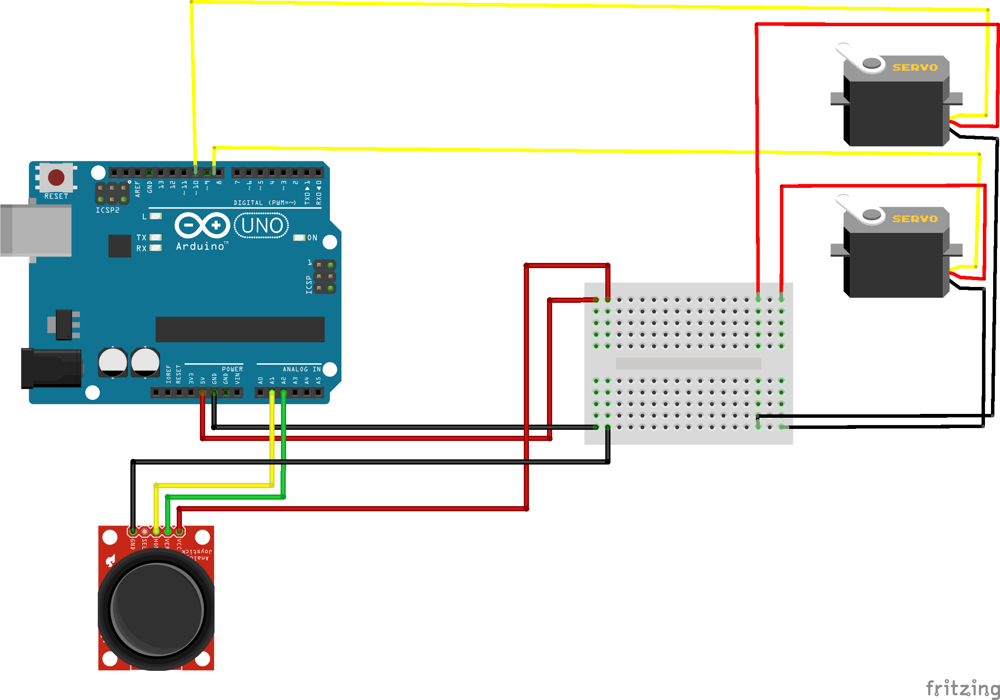

# arduino-robotik-kol

## Bileşenler
* Arduino Uno
* 2 Mini Servo Motor (SG90)
* 1 Joystick (2 eksenli XY)
* Breadboard
* Jumper kablolar
* Arduino USB power kablosu
* Powerbank

## Devre Şeması

# Youtube Video

